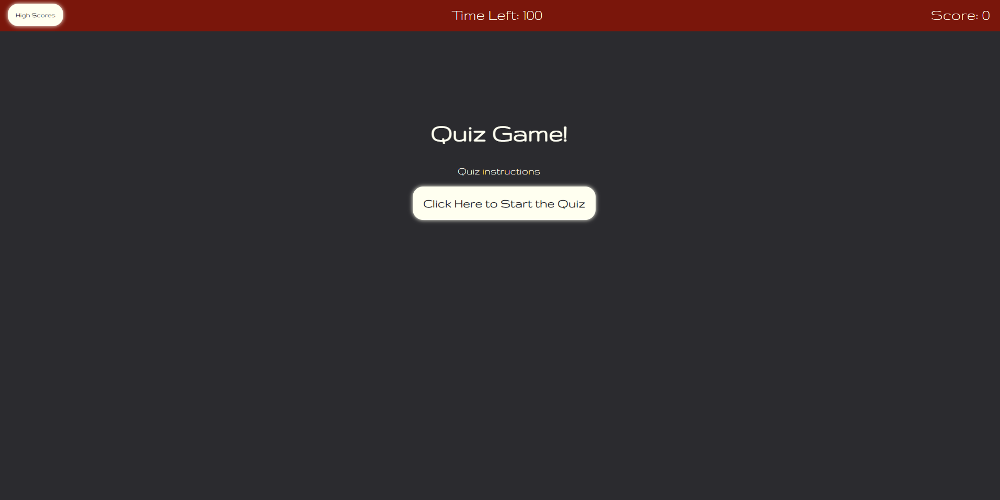
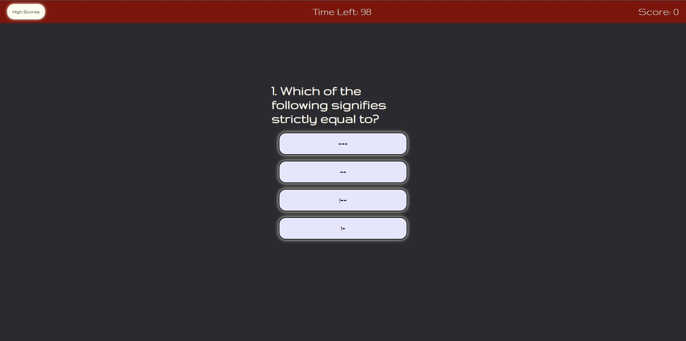
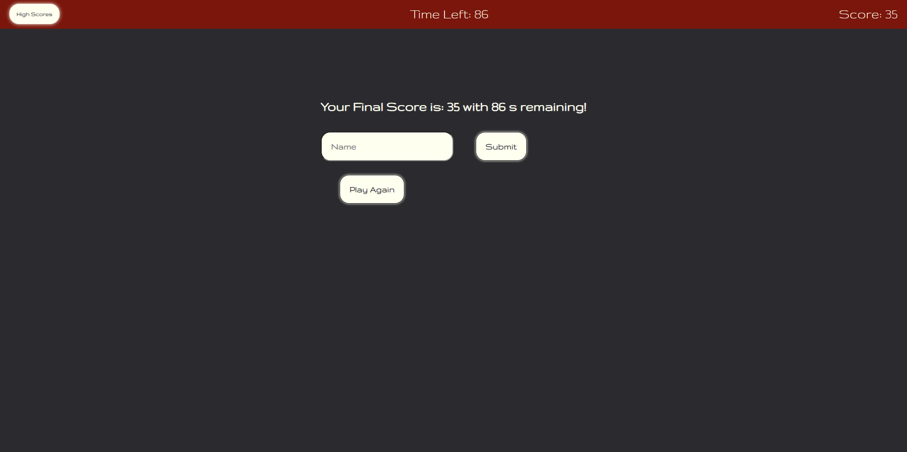
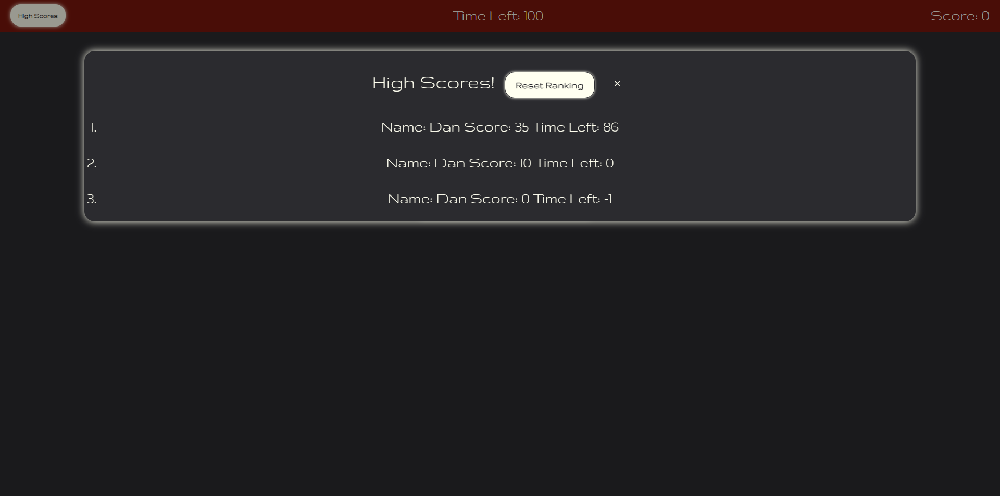

# Quiz Application

## Description

The purpose in creating this quiz application was to familiarize myself of Web APIs, javascript, css, and HTML. The contents of the quiz is easy but are questions to reinforce my knowledge of the coding languages I have been learning.

The quiz application was designed to be mobile friendly. It is quipped with a highscore leaderboard where users can track their progress.

Originally I was planning on sorting out the results to have the leaderboard in score order. However, with 3 properties to keep track of, it seemed difficult and tedious. This part of the application was put on hold for now.

If you would like to give my quiz a shot, please [click here!](https://lunirs.github.io/quiz-application/)

## Table of Contents

1. [Installation](#installation)
2. [Usage](#usage)
3. [Credits](#credits)
4. [License](#license)

## Installation

With building this application page, I started off by writing some pseudo code to determine the things I would need.

### Pseudo Code:

// Start button that runs the quiz
// Need start quiz function
// When button is pressed, timer starts, and quiz questions are displayed

// Question is answered (right or wrong)
// render question function
// displays question based on index
// creates 4 answer choices all in button format
// basically has an event.target to determine that the correct answer choice was clicked on
//once clicked it checks our answer

// function that checks our answer
// if wrong then time penalty and move on to next question
// displays incorrect
// if correct then display correct then move onto next question.

// countdown function
// time goes down at an interval of 1 second
// if time goes to 0 it ends the quiz
// end the game
// if user answers all questions and there are no more questions to be answered
// we clear the interval for time left and end the game

// function to end the game
// displays the score page
//asks user for name input
//once submit button is pressed, then data is stored on local storage

// data store function
// if there isn't an input then return
// else take the input and store on local storage

//high score page
// gets scores stored on local storage and displays them
// clear high score button
// function to delete local storage data

I then wrote down all the functions needed to run this program:

1. function to start quiz
2. function to start countdown
3. function to render my questions
4. function to check my answer
5. function to end the game
6. function to store results in local storage
7. function to take stored results and translate it onto the high score page.

I then added my dependencies based off of what functions I would need and what element would correspond to that function. This allowed me to write my HTML code smoothly.

My countdown was set to have a start time of 100 seconds and would cut down in 1 second intervals. If the user gets a question wrong, it would shave off 20 seconds off their remaining time. If the user answered the question correctly, it would move onto the next question.

Once the timer goes to 0 or the user answers all the questions, the page will display a new portion that will allow users to submit their name to record their name on the leaderboard. Once submit is clicked, the user can press the play again button to have the page refreshed. The user can then click the high score button on the top left to see the leaderboard.

If the user does not like the leaderboard and would like to reset it, they can press the reset button and it will delete all scores off the local storage.

## Usage

Here are some screenshots of my page!

### Start Page

### Question Page

### Ending Page

### Leaderboard Page

## Credits

I was able to finish this application thanks to these resources.

[MDN Local Storage](https://developer.mozilla.org/en-US/docs/Web/API/Window/localStorage)

[W3 Schools Modal](https://www.w3schools.com/howto/howto_css_modals.asp)

[MDN JSON](https://developer.mozilla.org/en-US/docs/Web/JavaScript/Reference/Global_Objects/JSON)

[MDN Event.target](https://developer.mozilla.org/en-US/docs/Web/API/Event/target)

[MDN Array.forEach()](https://developer.mozilla.org/en-US/docs/Web/JavaScript/Reference/Global_Objects/Array/forEach)

## License

Copyright (c) [2022] [Daniel Hong]
